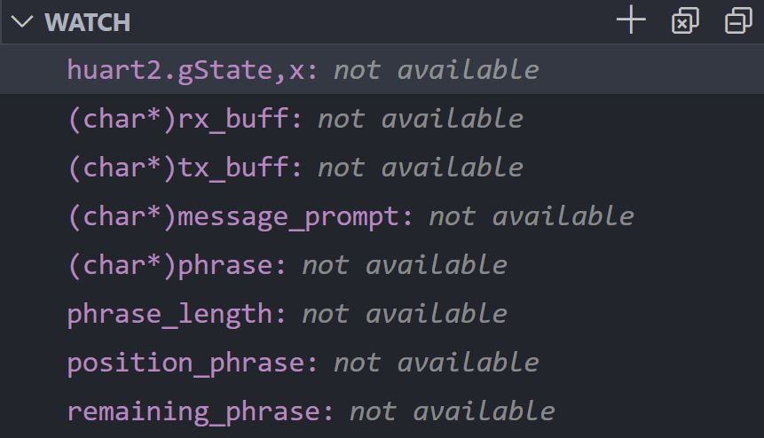
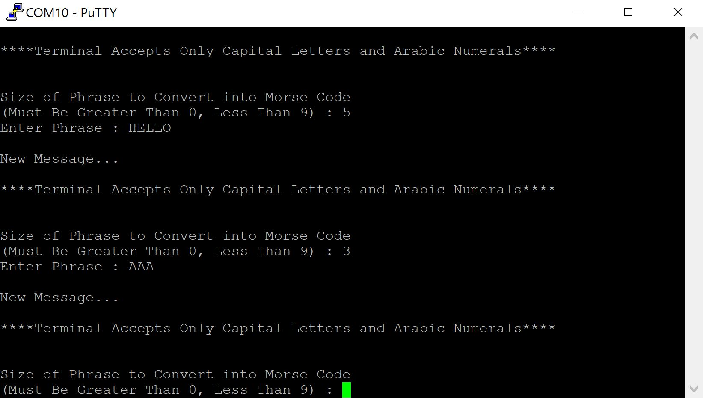

# STM32 Morse Translator

## Contents

* [Overview](#Overview)
    * [Features](#Features)
* [Project Structure](#Project-Structure)
    * [STM32CubeMX](#STM32CubeMX)
    * [Source Code](#Source-Code)
    * [Serial Communication](#Serial-Communication)
        * [DMA Controller](#DMA-Controller)
* [Build Tools](#Build-Tools)
    * [VSCode Editor](#VSCode-Editor)
    * [Flash Executable](#Flash-Executable)
* [Demonstration](#Demonstration)

## Overview

This was originally designed as part of a <b>UBC Orbit Command and Data Handling (CDH)</b> subsystem assignment. However, it has been recently redesigned to further explore embedded software development practices on the <b>STM32 Nucleo Board</b>.

<p align="center"></p>

### Features

A project is implemented to blink the <b>LD2</b> LED pin on the <b>STM32L476RG</b> and communicate with the computer terminal via <b>UART Serial Communication</b>.
This involved sending an <b>ASCII</b> phrase of a specified length to a serial <b>COM</b> port. The morse translation of the phrase is output onto the <b>LED</b>.

<p align="center"></p>

## Project Structure

### STM32CubeMX

The project files were generated using the <b>STM32CubeMX</b> Graphical Tool Software. The project configuration can be viewed and modified in the [(`Morse_Translator.ioc`)](Morse_Translator.ioc) file.

We selected the [Makefile](Makefile) toolchain to work with individually installed tools on the <b>VSCode</b> Editor.

### Source Code

The [(`main.c`)](Src/main.c) source file is modified to perform the translation and output onto the <b>STM32 LED</b>.

The respective header file [(`main.h`)](Inc/main.h) is modified as well to include relevant include statements, preprocessor directives, private function prototypes and constants.

### Serial Communication

The <b>UART</b> peripheral which communicates with the user is set in blocking mode. After the user has entered an input to the intended buffer, the <b>UART</b> peripheral is set to echo the input to the terminal.

The user may only enter capital letters and arabic numerals to the terminal. Otherwise the ```void Error_Handler();``` function is called to send an *ERROR* message and perform a software reset on the <b>STM32</b> system.

The <b>PuTTY SSH</b> client is used to establish a terminal connection with the <b>STM32</b> device as shown below. Note that the terminal clearing functionality implemented in the ```void newPhrase();``` function is designed for the <b>PuTTY</b> client.

<p align="center"></p>

#### DMA Controller

<b>Direct Memory Access (i.e. DMA)</b> is used to receive and transmit data directly between the <b>UART</b> peripheral and the memory. This speeds up the operations involving the input of the phrase and the subsequent echoing of the input to the terminal. <b>Polling</b> (i.e. blocking) operations are implemented for <b>UART</b> transmissions in the setup and error handling as we intend for these to be sequential with the code execution.

The ```void HAL_UARTEx_RxEventCallback(UART_HandleTypeDef *huart, uint16_t Size);``` callback function for the <b>USART2</b> global interrupt was implemented in the [(`main.c`)](Inc/main.c) source file. This is called when the line is idle momentarily or the data transfer is complete.

<i>Note : <b>STM32CubeMX</b> initialized code was slightly modified to initialize the <b>DMA</b> prior to the <b>UART</b> peripheral. Otherwise the data would not be received in the intended buffer.</i>

## Build Tools

### VSCode Editor

This project build and debug settings are specified in the [(`.vscode`)](.vscode) directory. The [(`launch.json`)](/.vscode/launch.json) and [(`c_cpp_properties.json`)](/.vscode/c_cpp_properties.json) were modified to integrate the debug functionality into <b>VSCode</b>.

The <b>Cortex-Debug</b> Extension made it easier to look at variables and register contents during runtime.

<p align="center">
    
</p>

Importing the <b>System View Description</b> from the [(`STM32L4x6.svd`)](STM32L4x6.svd) file in the launch settings gave the ability to view the peripheral register values during runtime as well.

### Flash Executable

Flashing the (`Morse_Translator.elf`) executable onto the <b>STM32 Nucleo Board</b> required the <b>ARM GCC</b> <b>C</b> Compiler, <b>Make</b> Automation Tool, and the <b>Open On-Chip Debugger (OpenOCD) Debugger</b> for Embedded Devices.

These tools were added to the <b>System Path</b> on the <b>Windows OS</b>.

The [(`Makefile`)](Makefile) is modified to include the `make flash` command.

```Makefile
#######################################
# flash
#######################################
flash: all
	openocd -f interface/stlink.cfg -f target/stm32l4x.cfg -c "program $(BUILD_DIR)/$(TARGET).elf verify reset exit"
```

## Demonstration

The videos in the [`Demonstration`](Demonstration) directory show the input via keyboard as well as the output on the <b>STM32 Nucleo Board</b>. I have embedded a low resolution compressed version below.

https://user-images.githubusercontent.com/52113009/130340990-af157688-376e-429a-9239-4267415a930c.mp4

The following image shows the <b>UART Communication</b> to the terminal for the output shown in the video.

<p align="center"></p>

<i>Images are sourced from STM32 Datasheets.</i>

## Credit

This project was recently modified following a <b>UART-DMA</b> tutorial from the <b><a href="https://controllerstech.com/uart-dma-with-idle-line-detection/">Controllers Tech</a> Youtube Channel</b>.